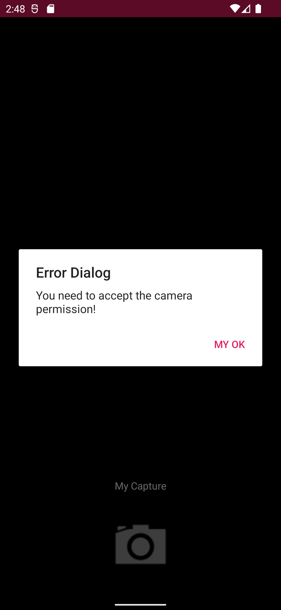

# Object proposal with cropping flow
This repository contains a kotlin/java Android project, that uses nyris SDK and nyris Camera to take an image, see suggested objects from the image and enable custom cropping.

# Structure
## camera
This is handled by this repo [Android Camera](https://github.com/nyris/Camera.Android)

## croppingview-lib
it's an feature which is extracted from this [library](https://github.com/ArthurHub/Android-Image-Cropper). We adjusted the feature to fit the purpose of the object proposals. 

## nyris sdk
This is handled by this repo [Android SDK](https://github.com/nyris/SDK.Android)

## ui-lib
UI Lib, is a library which integrate the previous mentioned modules into one UI module. 
It offers:
* Take a picture and optimized to fit the api requirements 
* Easy cropping tool which is based on the cropping proposals api
* and image matching with a result page. 

### TO NOTE 
The ui-lib does not offer a way to handle the camera permission, you need to handle that by your self! 
Also the demo app does not handle the camera permission, so you need to enable the permission manually otherwise you will get an error like this one



## integration
You will need an api key to make this demo to work properly. 

You cant start fast by running this:
```kotlin
    NyrisSearcher(this /*could be an activity or a fragment*/, apiKey = "YOUR_API_KEY", isDebug = true)
        .host("YOUR_HOST") // your host or proxy
        .dialogErrorTitle("Error Dialog") // the title of the error dialog
        .positiveButtonText("My OK") // the positive dialog text
        .captureLabelText("My Capture") // the text above the camera button
        .noOfferFoundErrorText("No offers found :(") // The error message when no result found
        .cameraPermissionDeniedErrorMessage("You need to accept the camera permission!") // When the camera permission is denied!
        .limit(20) // the size of the result
        .start()
```

## The demo
